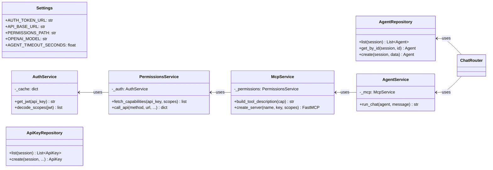
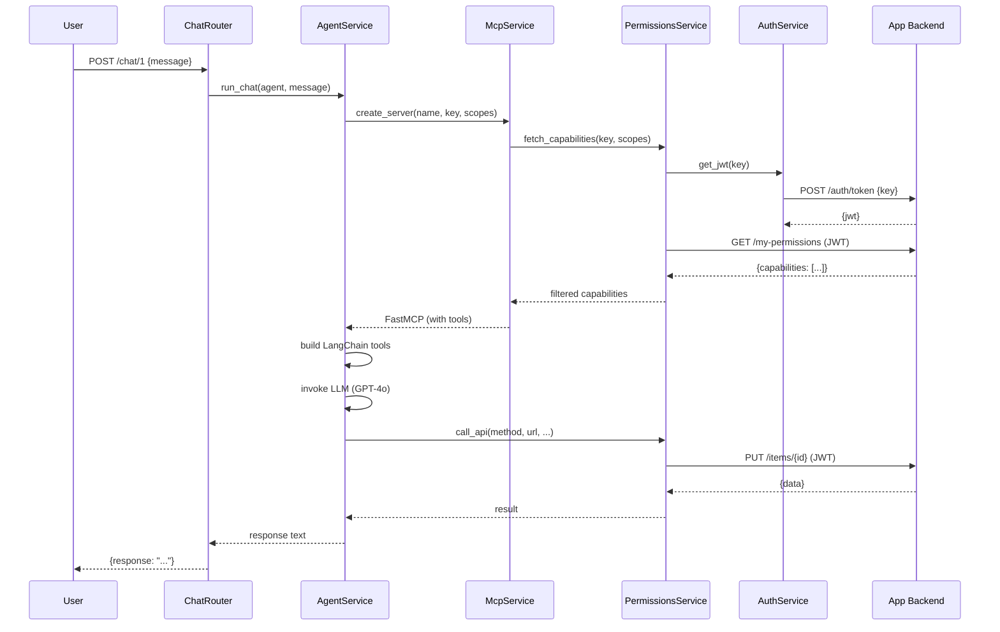

# MCP Integration Guide — Connecting Any MCP Server with an Application Backend

## Overview

This guide documents the architecture used to connect a **FastMCP server** with an **application backend** (Django, Rails, Express, etc.) using scope-based tool discovery. The LLM agent only sees and can use the tools explicitly permitted by its API key's scopes.

```
┌─────────┐     ┌──────────────────────────────────────────────────┐     ┌────────────────┐
│  User   │────▶│           MCP Dashboard Backend                  │────▶│  App Backend    │
│ (Chat)  │     │                                                  │     │  (Django, etc.) │
│         │◀────│  Router → Service → MCP → LLM → Tool → HTTP ──▶│◀────│  /my-permissions │
└─────────┘     └──────────────────────────────────────────────────┘     └────────────────┘
```

---

## Architecture (SOLID)



### Layer Summary

| Layer | Responsibility | SOLID Principle |
|-------|----------------|-----------------|
| `config.py` | Centralized env vars | Single Responsibility |
| `repositories/` | Pure DB CRUD | Single Responsibility, Interface Segregation |
| `services/auth_service.py` | JWT acquisition + caching | Single Responsibility |
| `services/permissions_service.py` | HTTP calls to app backend | Single Responsibility, Dependency Inversion |
| `services/mcp_service.py` | FastMCP tool registration | Open/Closed (new backends = new config) |
| `services/agent_service.py` | LLM orchestration | Dependency Inversion (depends on McpService) |
| `routers/` | HTTP endpoints (thin) | Single Responsibility |

---

## Files and Classes Reference

### `backend/config.py` — Settings
```python
class Settings:
    AUTH_TOKEN_URL: str      # POST endpoint to exchange API key → JWT
    API_BASE_URL: str        # Base URL of the application backend
    PERMISSIONS_PATH: str    # Path to the permissions endpoint
    OPENAI_MODEL: str        # LLM model name
    AGENT_TIMEOUT_SECONDS: float
    JWT_CACHE_TTL: int       # Seconds to cache JWT tokens
```

### `backend/services/auth_service.py` — AuthService
```python
class AuthService:
    async def get_jwt(api_key: str) -> str
        """POST api_key to AUTH_TOKEN_URL, get JWT, cache it."""

    def decode_scopes(jwt_token: str) -> list[str]
        """Decode JWT claims to extract scopes. No signature verification."""
```

### `backend/services/permissions_service.py` — PermissionsService
```python
class PermissionsService:
    async def fetch_capabilities(api_key: str, selected_scopes: list[str]) -> list[dict]
        """GET /my-permissions with JWT, filter capabilities by scopes."""

    async def call_api(method, url, api_key, path_params, query_params, body) -> dict
        """Execute authenticated HTTP request against the app backend."""
```

### `backend/services/mcp_service.py` — McpService
```python
class McpService:
    @staticmethod
    def build_tool_description(capability: dict) -> str
        """Build LLM-friendly description from capability metadata."""

    async def create_server(agent_name, api_key, selected_scopes) -> FastMCP
        """Create FastMCP instance with only the tools allowed by scopes."""
```

### `backend/services/agent_service.py` — AgentService
```python
class AgentService:
    async def run_chat(agent: Agent, user_message: str) -> str
        """Full orchestration: build MCP → convert to LangChain tools → invoke LLM."""
```

### `backend/repositories/`
```python
class ApiKeyRepository:
    @staticmethod list(session, offset, limit) -> list[ApiKey]
    @staticmethod create(session, name, key, valid_scopes) -> ApiKey

class AgentRepository:
    @staticmethod list(session, offset, limit) -> list[Agent]
    @staticmethod get_by_id(session, agent_id) -> Agent | None
    @staticmethod create(session, agent_data) -> Agent
```

### `backend/routers/`
```python
# api_key_router.py
POST /api_keys/   → validate key via AuthService, create via ApiKeyRepository
GET  /api_keys/   → list via ApiKeyRepository

# agent_router.py
POST /agents/     → create via AgentRepository
GET  /agents/     → list via AgentRepository

# chat_router.py
POST /chat/{id}   → AgentService.run_chat()

# mcp_router.py
GET|POST|DELETE /mcp/{id}  → Streamable HTTP MCP transport
```

---

## How to Implement with ANY MCP Server

### Step 1: Permissions Endpoint

Your application backend must expose a permissions endpoint that returns the tools available for a given API key. Expected format:

```json
{
  "key_name": "my_api_key",
  "scopes": ["catalog:read", "catalog:update"],
  "expires_in_seconds": 600,
  "capabilities": [
    {
      "id": "unique_function_id",
      "scope": "catalog:read",
      "kind": "tool",
      "name": "list_items",
      "method": "GET",
      "path": "/api/v1/admin/items",
      "summary": "List Items",
      "description": "Lists all items with pagination.",
      "parameters": [
        { "name": "limit", "in": "query", "type": "integer", "required": false },
        { "name": "offset", "in": "query", "type": "integer", "required": false }
      ]
    },
    {
      "id": "unique_function_id_2",
      "scope": "catalog:update",
      "kind": "tool",
      "name": "update_item",
      "method": "PUT",
      "path": "/api/v1/admin/items/{item_id}",
      "summary": "Update Item",
      "description": "Updates an existing item.",
      "parameters": [
        { "name": "item_id", "in": "path", "type": "integer", "required": true },
        { "name": "name",    "in": "body", "type": "string",  "required": false }
      ]
    }
  ]
}
```

**Key fields per capability:**
- `scope` — which permission scope this tool belongs to
- `kind` — `"tool"` (action) or `"resource"` (read-only)
- `name` — unique function name for the LLM
- `method` / `path` — HTTP method and URL pattern
- `description` — human-readable description (used by the LLM to decide when to call it)
- `parameters[]` — with `name`, `in` (path/body/query), `type`, `required`

### Step 2: Auth Endpoint

An endpoint that exchanges an API key for a JWT (or similar bearer token):

```
POST /api/v1/auth/token
Body: {"key": "your_api_key"}
Response: {"jwt": "eyJhbG..."}
```

### Step 3: Configure the MCP Dashboard

```env
# .env
MCP_OPEN_AUTH_URL=https://your-backend.com/api/v1/auth/token
MCP_API_BASE_URL=https://your-backend.com
OPENAI_API_KEY=sk-...
```

### Step 4: Create an Agent

```bash
# Register the API key
curl -X POST http://localhost:8001/api_keys/ \
  -H "Content-Type: application/json" \
  -d '{"name": "my_key", "key": "actual_api_key_value"}'

# Create an agent with specific scopes
curl -X POST http://localhost:8001/agents/ \
  -H "Content-Type: application/json" \
  -d '{
    "name": "Catalog Manager",
    "system_prompt": "You are a catalog management assistant.",
    "selected_scopes": "catalog:read, catalog:update",
    "api_key_id": 1
  }'
```

### Step 5: Chat

```bash
curl -X POST http://localhost:8001/chat/1 \
  -H "Content-Type: application/json" \
  -d '{"message": "list all items"}'
```

The agent will:
1. Fetch JWT using the API key
2. Call `/my-permissions` to discover available tools
3. Filter to only `catalog:read` + `catalog:update` capabilities
4. Register them as MCP tools
5. Let the LLM decide which tool to call
6. Execute the HTTP request and return the response

### Step 6: MCP Transport (Optional)

External MCP clients can connect via streamable HTTP:

```
GET|POST /mcp/{agent_id}
```

This exposes the agent's scoped tools as a standard MCP server that any MCP-compatible client can consume.

---

## Flow Diagram


